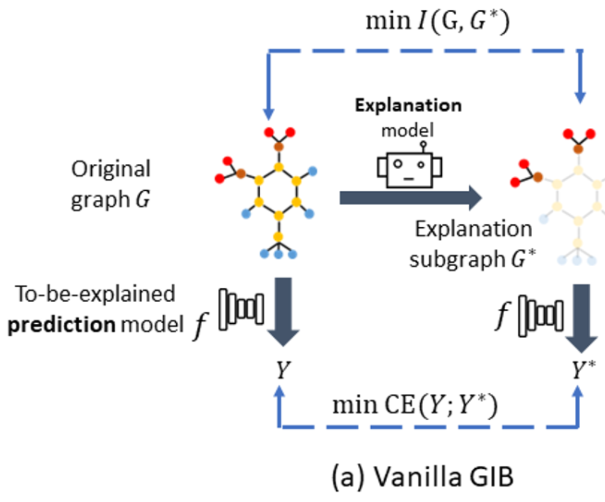
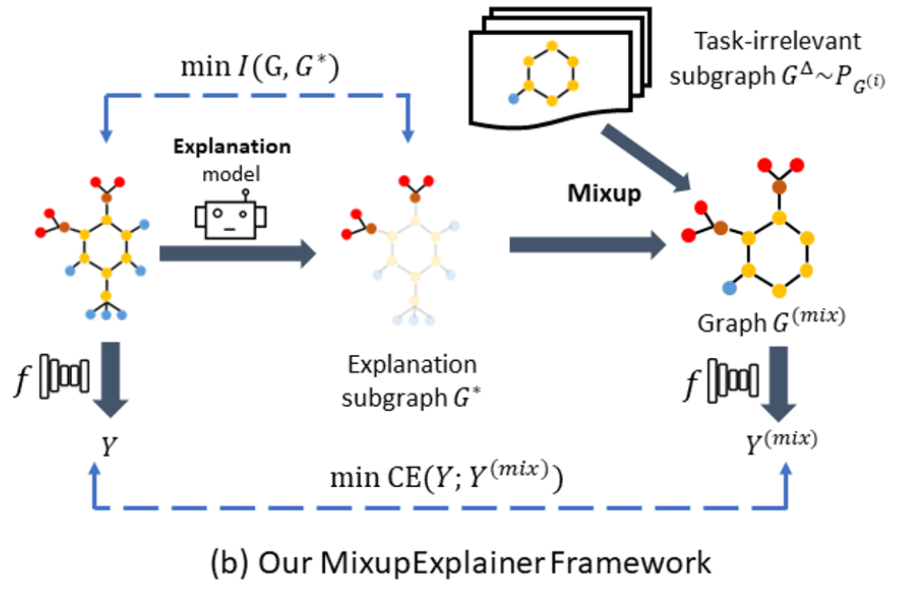

# Mixup-Explainer: Generalizing Explanations for Graph Neural Networks with Data Augmentation

作者：Jiaxing Zhang*, New Jersey Institute of Technology; Dongsheng Luo*, Florida International University; Hua Wei, Arizona State University

Accepted by SIGKDD2023 

## 背景与贡献

现有的解释器在对图神经网络的输入进行解释时，通常会生成输入的一个重要子图作为解释，进而通过Graph Information Bottleneck（图信息瓶颈） Objective对解释子图进行优化。但是，先有方法在进行解释时忽略了解释子图的分布偏移问题，即子图的分布与原图数据集不同（不同的节点数量与差异的拓扑结构）。因此，通过GIB直接对解释子图进行优化是存在问题的。

MixupExplainer主要有以下贡献：

1. 我们第一次指出了图分类任务的可解释性上的分布偏移问题（Out-Of-Distribution）。这个问题在现有的方法与解释器框架中广泛存在。
2. 我们提出了一种图混合框架：这个框架基于mix-up方法改进而来，可以直观且有效的缓解分布偏移问题，并且与GIB目标相结合，提升解释质量。
3. 我们的框架是可泛化的，这意味着我们可以在各种图解释器上应用它对各种图神经网络产生解释，并取得性能提升。我们在GNNExplainer与PGExplainer应用了此框架，取得了最高35.5%的提升。

## 问题定义

> 问题定义：假设我们有一个图神经网络 $f$ 以及一个图输入 $G$，post-hoc instance-level 图解释器的目标是找到一个可以解释$f$
>
> 对$G$所做的预测的解释子图 $G^*。

例如在下图中，我们有一个来自于Mutag数据集的分子，假设我们有一个训练好的图分类器对此分子做出预测，那么预测的结果（标签）取决于该分子是否包含$NO_2$ 与$NH_2$分子。所以，左图$G_a$解释应当是右图中的分子子图$G_a^*$.

 -> 

## 现有方法与其面临的挑战

现有的图解释器，例如GNNExplainer（基于边权优化），PGExplainer（基于全局理解的参数化生成边权）通常使用GIB objective对解释子图（边权）进行优化。

即如下公式：

$$
\underset{{G^*}}{\argmin} I(G, G^*)-\alpha I(G^*,Y)
$$

该目标致力于产生一个尽可能小的同时又包含尽可能多的标签信息的解释。在公式中，我们一方面优化$G^*$的大小（我们通常认为解释是一个小的紧密的子图）；另一方面提高$G^*$与标签的共有信息，即这个解释就在某种程度上对应着标签或者使得图神经模型做出正确的预测。

但是，现有的方法忽略了子图的分布偏移问题。如下图所示：

这张图中，红点代表着原图，蓝点代表着解释子图，我们可以看到，蓝点的分布相较于红点在分布空间上有着较大的偏移。如果没有偏移，蓝点应当与红点重合。这个偏移进一步导致了 $f$， 即图中的黑色实线段无法对蓝点做出合理的预测，因为它是在红点上被训练的。这可以用如下公式说明:

$$
f(G^*) \neq f(G) \Rightarrow I(G^*;Y) \neq I(G;Y)
$$

由于$f$无法对$G^*$做出正确的预测，那么当我们计算信息熵$I(G^*,Y)$时，也就无法得出正确的结果。因为我们使用形如$\text{CE}(f(G^*), Y)$对此信息熵进行近似。我们实际上期望$f(G^*)$产生与$f(G)$相同的结果，但由于分布偏移，这一点无法实现。

## 我们的解决方案：Mix-up框架

针对以上挑战，我们提出了一种可泛化的mix-up框架进行应对。如下图所示，在产生了解释子图$G^*$以后，我们将其与另一张随机选取的图中的基图（即与标签无关的部分）进行混合。这样我们既保留了该解释应有的标签信息，也将该解释的分布恢复到了原图所在的分布空间。

新的GIB objective如下公式所示：

$$
\underset{{G^*}}{\argmin} I(G, G^*)-\alpha I(G^\text{(mix)},Y)
$$

在这个目标中，我们除了依旧约束$G^*$的大小以外，还通过优化混合图$G^{\text{(mix)}}$与$Y$之间的信息熵来优化解释子图。图混合操作是一个非参数化的过程，不影响子图的产生与梯度的传播。我们的mix-up方法可以用以下公式说明：

$$
M_a^{\text{(mix)}} = M_a + (A_b - M_b)
$$

这意味着我们将一个解释子图 $G^*$ 与一个标签无关的基图 $G^\Delta$ 混合起来。进而我们可以正确的估计 $I(G^\text{(mix)}, Y)$。

## 数据集与实验结果

实验所用的数据集如下图所示，其中，MUTAG是真实数据集，其他五个数据集为人造数据集。

实验对比了GNNExplainer（+mix-up），PGEXplainer（+mix-up）与多个基线的性能表现。

可以看到，mix-up方法在所有数据集上都对基准方法产生了提升。并且在部分数据集中取得了最佳效果。

## 总结

这个工作介绍了一种可以应用于各种图解释器的mix-up框架。该框架可以有效的缓解子图的分布偏移问题并提升解释器的性能表现。

### Reference

[1]. J. Zhang, D. Luo, and Hua Wei. "MixupExplainer: Generalizing Explanations for Graph Neural Networks with Data Augmentation".
In Proceedings of 29th ACM SIGKDD Conference on Knowledge Discovery and Data Mining (SIGKDD), 2023.

[2]. Github repository with datasets and code for Mixup-Explainer: https://github.com/jz48/MixupExplainer
