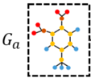
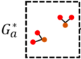
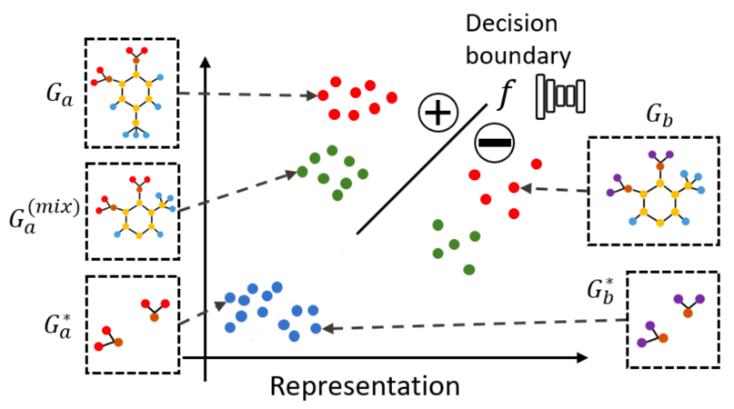
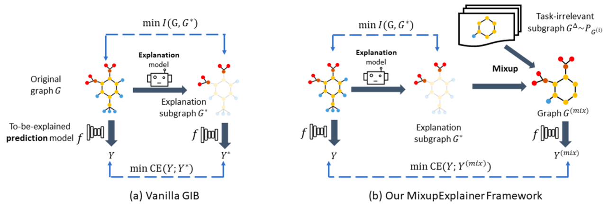
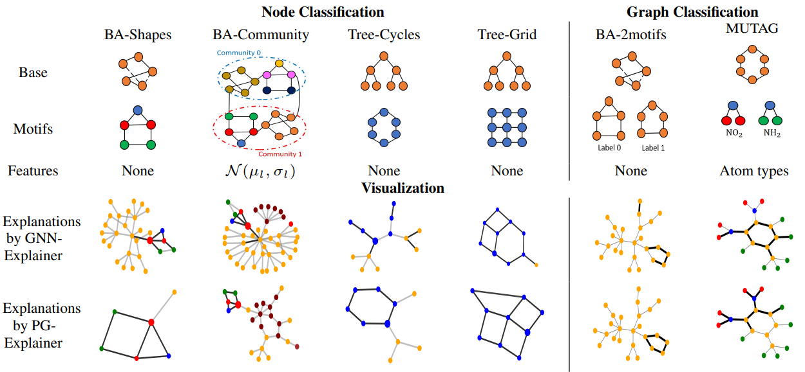
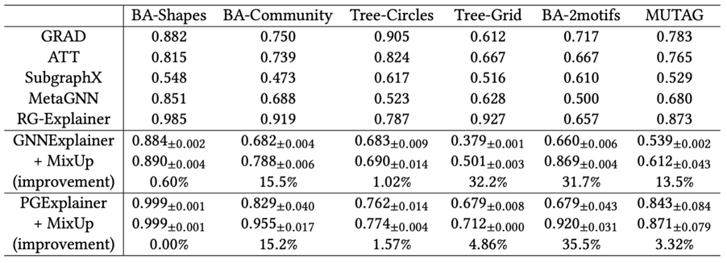

## Mixup-Explainer: Generalizing Explanations for Graph Neural Networks with Data Augmentation

Jiaxing Zhang*,  New Jersey Institute of Technology

Dongsheng Luo*,  Florida International University

Hua Wei, Arizona State University

Accepted by SIGKDD2023 

### Key Points
The proposed MixupExplainer framework aims to improve the quality of explanations for Graph Neural Networks (GNNs) by 
addressing the distribution shift problem. This issue arises when the explanation sub-graphs and original graphs training dataset have 
different underlying data distributions, leading to poor quality of the explanations across different datasets on various explainers.

The Mixup-Explainer framework consists of two main steps:

1. Mixed Graph Construction: A mixed graph is created by combining the original graph with a randomly sampled base graph. 
2. Explanation Substructure Optimization: The explanation substructure is obtained by optimizing the GIB objective.

Empirical studies on synthetic and real-life datasets demonstrate that the MixupExplainer framework significantly improves the quality of explanations, with up to 35.5% in AUC scores. 
This improvement highlights the effectiveness of the proposed approach in mitigating the distribution shifting problem and providing more robust and generalizable explanations for GNN models.

In conclusion, the MixupExplainer framework is a novel method for generating explanations for GNNs that addresses the distribution shifting problem and provides more robust and generalizable explanations. 

### Problem Definition

Given a trained GNN model $f$ ,for an arbitrary input graph $G$, the goal of post-hoc instance-level GNN explanation is 
to find a subgraph $G^*$ that can explain the prediction of $G$ on $f$. 

 -> 

### Challenge in Existing Methods

As shown in the figure, there is a large distributional divergence between explanation sub-graphs 
and original graphs.

It means that explanation embeddings are out of distribution with respect to the original graphs, 
which leads to impaired safe usage of the approximation because of the inductive bias in $f$:

$$f(G^*) \neq f(G) \Rightarrow I(G^*;Y) \neq I(G;Y)$$

We called this distribution shifting problem. GNN model $f$ could not make correct prediction with $G^*$. 
Thus, the estimation of mutual information with $G^*$ in existing methods is problematic, 
which would decrease the quality of the explanation sub-graph.

We propose mix-up approach to recover the distribution of the explanation sub-graph $G^*$ and alleviate the problem within GIB framework.

Original GIB objective: $$\underset{{G^*}}{\text{argmin}} I(G, G^*)-\alpha I(G^*,Y)$$

To retrieve an explanation sub-graph for the original graph, the existing methods usually optimize the GIB objective, 
which means finding a sub-graph $G^*$ with a limited size and maximum mutual information towards $Y$.

### Method

The proposed MixupExplainer framework aims to improve the quality of explanations for Graph Neural Networks (GNNs) by addressing the distribution shift problem. 

Vanilla GIB directly minimizes $CE(Y, Y^*)$, which is the cross entropy between the original prediction $Y$ and the 
prediction of explanation subgraph $G^*$ made by the to-be-explained model $f$.

Our MixupExplainer first generates an augmented graph $G^{\text{(mix)}}$ by mix-up the explanation subgraph $G^*$ with 
the label-independent part from another randomly sampled graph. Then we minimize the cross entropy between $Y$ 
and $Y^{\text{(mix)}}$, the prediction made by $f$ on $G^{\text{(mix)}}$. 

Mix-up approach: $$M_a^{\text{(mix)}} = M_a + (A_b - M_b)$$

The mixup approach would mix the explanation sub-graph $G^*$ and label-irrelevant sub-graph $G^\Delta$ together to 
recover the distribution of $G^*$. Therefore, we could estimate the mutual information $I(G^*, Y)$ correctly.

### Result

The experiments are conducted on five synthetic datasets and a real-life dataset:

This table shows the explanation faithfulness in terms of AUC-ROC on edges under six datasets. The higher, the better. 
Mix-up approach achieves consistent improvements over backbone GIB-based explanation methods. 

Empirical studies demonstrate that the MixupExplainer framework significantly improves the quality of explanations, 
with up to 35.5% in AUC scores. This improvement highlights the effectiveness of the approach in mitigating the 
distribution shift problem and providing more robust and generalizable explanations for GNN models.

### Conclusion

In this work, we study the distribution shifting problem to obtain robust explanations for GNNs, which is 
largely neglected by the existing GIB-based post-hoc instance-level explanation framework. With a close analysis of the 
explanation methods of GNNs, we emphasize the possible distribution shifting issue induced by the existing framework. We 
propose a simple yet effective approach to address the distribution shifting issue by mixing up the explanation with a 
randomly sampled base graph structure. The designed algorithms can be incorporated into existing methods with no effort. 
Experiments validate its effectiveness, and further theoretical analysis shows that it is more effective in alleviating 
the distribution shifting issue in graph explanation. In the future, we will seek more robust explanations. Increased 
robustness indicates stronger generality and could provide better class-level interpretation at the same time. 

### Reference

[1]. J. Zhang, D. Luo, and Hua Wei. "MixupExplainer: Generalizing Explanations for Graph Neural Networks with Data Augmentation".
 In Proceedings of 29th ACM SIGKDD Conference on Knowledge Discovery and Data Mining (SIGKDD), 2023.

[2]. Github repository with datasets and code for Mixup-Explainer: https://github.com/jz48/MixupExplainer